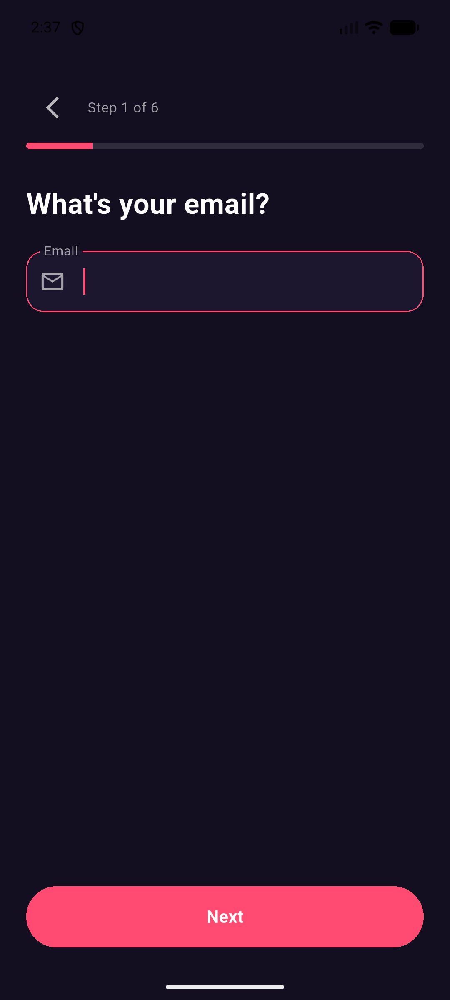

<div align="center">


# Weekend — Free Dating App for Android · Open Source

**Make Every Weekend Brighter.** Weekend is a free, location-based dating app
for Android: discover people nearby, match on shared interests, chat in real
time — and turn conversations into real weekend plans.

Free • Open Source • Android • Privacy-first

[](https://developer.android.com/)
[](https://flutter.dev/)
[](https://dart.dev/)
[](https://supabase.com/)
[](https://github.com/zypherlabs-bit/Weekend/actions/workflows/ci.yml)
[](https://github.com/zypherlabs-bit/Weekend/releases/latest)
[](LICENSE)

**[⬇️ Download Weekend v2.7.0](#download-weekend)** ·
**[❓ FAQ](#faq)** ·
**[💻 Source code](https://github.com/zypherlabs-bit/Weekend)**

</div>

---

**Weekend** is a free, open-source dating and social discovery app for Android.
It is built with **Flutter (Dart)** and a **Kotlin/Android** host layer on top of
a **Supabase** backend (PostgreSQL + PostGIS, Auth, Storage, Realtime and Edge
Functions). Weekend helps people find others nearby, match on shared interests,
chat in real time, and turn conversations into real weekend plans — while
keeping location and personal data deliberately private.

- 📱 **A genuinely free dating app** — download the APK and start matching: no
  subscription, no paid likes, no paywall on messaging or plans
- 🔓 **Open source (MIT)** — inspect every line, self-host the backend, or contribute
- 📍 **Location-based discovery, privacy-first** — nearby, crossed-paths and
  global modes without ever exposing exact GPS coordinates
- 💬 **Real-time messaging** with mutual matches
- 📅 **Weekend Plans**, QR invitations, biometric app lock and a full safety centre

---

## Table of contents

- [Screenshots](#screenshots)
- [Why Weekend?](#why-weekend)
- [How it works](#how-it-works)
- [Features](#features)
  - [Location-based discovery](#location-based-discovery)
  - [Advanced search](#advanced-search--server-side-hard-filters)
  - [Passkeys](#passkeys-webauthn--credential-manager)
  - [Matchmaking](#matchmaking)
  - [Real-time messaging](#real-time-messaging)
  - [Weekend Plans](#weekend-plans)
  - [QR invitations](#qr-invitations)
  - [Biometric app lock](#biometric-app-lock)
  - [Safety, reporting and blocking](#safety-reporting-and-blocking)
  - [Profile verification and photo moderation](#profile-verification-and-photo-moderation)
  - [Advertisement-supported free experience](#advertisement-supported-free-experience)
- [Free dating on Weekend](#free-dating-on-weekend)
- [Download Weekend](#download-weekend)
- [FAQ](#faq)
- [Open source](#open-source)
- [Known limitations](#known-limitations)
- [Roadmap](#roadmap)
- [Developer documentation](#developer-documentation)
  - [Technology stack](#technology-stack)
  - [Architecture](#architecture)
  - [Supabase backend](#supabase-backend)
  - [Developer setup](#developer-setup)
  - [Configuration](#configuration)
  - [Building the Android APK](#building-the-android-apk)
  - [Testing](#testing)
  - [Verification status](#verification-status)
  - [Project structure](#project-structure)
  - [Security](#security)
  - [Privacy](#privacy)
- [Contributing](#contributing)
- [Documentation](#documentation)
- [License](#license)

---

## Screenshots

<p align="center">
  
  
  
  
</p>

<p align="center"><em>Real captures from the running app — onboarding & the 6-step sign-up wizard</em></p>

<p align="center">
  
  
  
  
</p>

<p align="center"><em>Brand artwork — discovery, matching, chat and profiles</em></p>

> **Screenshot honesty note:** the first row was captured from the running app;
> the second row is brand artwork, not app captures. Verified screenshots of the
> signed-in experience (discovery, matching, chat) are tracked on the
> [roadmap](#roadmap) — they require a signed-in account on a Supabase backend,
> and this repository never publishes captures containing real people's
> profiles. You can explore the onboarding and sign-up flow yourself in
> [offline demo mode](#run-without-a-backend-offline-demo-mode).

---

## Why Weekend?

Most dating apps are closed source, put basic interactions behind a paywall, or
are careless with location data. Weekend exists to prove the opposite: a **free
dating app** can be open, honest and privacy-first at the same time.

| What you get | Why it matters |
| --- | --- |
| **Truly free dating** | Likes, matches, messaging and Weekend Plans are free — no subscription, no paid likes, no paywall on core features. The app is funded by clearly labelled, privacy-preserving ads instead of by charging you. |
| **Nearby people, not just a global feed** | Location-based discovery shows people around you, with a radius you control (0.5–100 km). Distance is computed on the server; exact GPS coordinates are never shown to other users. |
| **Plans, not just chats** | Weekend Plans turn a match into an activity: create or join local plans — coffee, dinner, events — and meet around something you actually want to do. |
| **Safety built in** | Reporting, blocking, unmatching, photo verification, a trust score, a full safety centre and an optional biometric app lock. |
| **Server-side security** | Row Level Security on every table; the client is treated as fully inspectable, so nothing security-critical relies on the app binary. |
| **Open source and self-hostable** | The complete app, database schema, RLS policies and Edge Functions ship under the MIT licence — point it at your own Supabase project in minutes. |

---

## How it works

1. **Download the APK** — grab Weekend from
   [GitHub Releases](https://github.com/zypherlabs-bit/Weekend/releases/latest)
   (see [Download](#download-weekend)) and install it on your Android device.
2. **Create your profile** — sign up with email and password, add photos,
   interests, prompts and your weekend availability. Photo verification and a
   trust score help others see you are real.
3. **Discover people nearby** — Weekend uses your location to surface people
   around you. You control the radius, the discovery mode and exactly what is
   shared — other users only ever see a locality and an approximate distance.
4. **Match and chat** — when two people like each other, a mutual match opens a
   real-time conversation. Messages arrive live, with read state and
   server-enforced safety rules.
5. **Make weekend plans** — move from chat to reality: create or join a Weekend
   Plan, or share a signed QR invitation so friends can join Weekend too.

---

## Features

Everything listed below ships in the current release. Known gaps are listed
openly in [Known limitations](#known-limitations).

### Location-based discovery

Weekend is a **location-based dating app** at its core: discovery is anchored to
where you are, while the location data itself stays private.

- **Nearby discovery** — `DiscoveryMode.nearby` returns profiles around your
  current position using the `get_nearby_profiles` RPC and PostGIS distance
  computation performed on the server.
- **Discovery radius** — choose a radius of 0.5, 1, 5, 10, 25, 50 or 100 km.
  The radius is applied server-side.
- **Discovery modes** — the Explore screen exposes chips for For You, Nearby,
  Around Me, City, Global, Travel Mode, Crossed Paths, Interests and Plans. The
  mode is passed to the RPC as a hint; today the query applies the
  distance/age/gender filters, excludes people you have already liked, passed,
  matched, blocked or reported, and ranks by distance, compatibility and activity.
- **Crossed Paths** — Weekend records privacy-safe location *buckets* (geohash
  precision 7, ≈150 m) instead of raw coordinates. When you and another person
  occupy the same bucket inside a time window, `compute_crossed_paths` can
  surface that as a crossed path.
- **Travel mode** — discover people in another city, stored with your location
  preferences.
- **City and approximate distance** — other users see a locality and an
  approximate distance such as "5 km away", never a coordinate pair.
- **Granular location controls** — independent switches for location discovery,
  nearby discovery, distance display and crossed paths, plus a
  permission-explaining screen before Android's location prompt is shown.

Implementation: `lib/services/location_service.dart`,
`lib/features/discovery/`, `supabase/migrations/022_advanced_search.sql`.
Details: [docs/location-discovery.md](docs/location-discovery.md).

### Advanced search — server-side hard filters

A dedicated **Discover / Search Filters** screen lets you narrow results by
several criteria at once — and **every hard filter is enforced in PostgreSQL**,
inside the `search_profiles` function, with `AND` semantics:

| Filter | Server parameter | Notes |
| --- | --- | --- |
| Gender / Interested in | `p_genders`, `p_interested_in` | |
| Age range | `p_age_min`, `p_age_max` | A profile with no stated age is **excluded**, not passed |
| Distance | `p_max_distance_km` | PostGIS `ST_DWithin` |
| Relationship intent | `p_relationship_intents` | |
| City / Interests / Languages / Lifestyle | `p_cities`, `p_interests`, … | |

- If your filters return nothing, **"No profiles match all your filters" is
  truthful** — the app offers *Adjust filters*, *Increase distance* and *Expand
  age range* as explicit actions. It never quietly relaxes a filter behind your back.
- Shared interests, intent match, verification and recency only affect
  **ordering** — they can never admit a profile a hard filter rejected.
- Results carry a rounded distance in kilometres. **No coordinates of any other
  user are ever returned to the client.**

---

### Passkeys (WebAuthn / Credential Manager)

Weekend supports **standards-based passkey authentication** through Supabase
Auth's native passkey API and the Android Credential Manager: the server issues
a challenge, the device signs it with a hardware-backed key, and the server
verifies the signature and issues a real session. No private key ever leaves the
device, and user verification (fingerprint, face or device PIN) is mandatory.

> ### ⚠️ Current status: passkeys are NOT enabled on the live project
>
> The client implementation is complete and the challenge endpoint is live, but
> the Supabase project still answers `passkey_disabled`. **Passkey sign-in does
> not work yet.** The app detects this and tells the user to use email and
> password — it never pretends a passkey succeeded. Enabling it requires the
> Supabase *Passkeys* setting, a relying-party ID and a matching
> `assetlinks.json`. See [docs/passkeys.md](docs/passkeys.md) and
> [Verification status](#verification-status).

Implementation: `lib/repositories/auth_repository.dart`,
`lib/services/passkey_service.dart`, `lib/features/auth/auth_screen.dart`.

### Matchmaking

A deliberately simple, honest matching model — this is a **matchmaking app**,
not an endless swipe machine:

- **Likes and passes** — unlimited for every user; there is no paid-like or
  pay-to-match mechanic in the current release.
- **Mutual matches** — a database trigger (`check_mutual_like`) creates a match
  when two people like each other, and creates the conversation record at the
  same time.
- **Shared interests** — profiles carry interests, prompts, languages,
  favourite places and weekend availability; common interests are highlighted
  when you view a profile.
- **Compatibility explanation** — profile cards include a short, human-readable
  explanation of why a profile is being suggested (distance, shared interests, activity).
- **Genuine profiles** — trust score and photo-verification state are surfaced
  on profile cards.
- **Match celebration** — a dedicated match dialog, and matches are the only
  way to start a conversation.

Implementation: `lib/providers/weekend_provider.dart`,
`lib/repositories/match_repository.dart`,
`lib/widgets/match_celebration_dialog.dart`,
`supabase/migrations/003_database_functions.sql`.

### Real-time messaging

A **real-time dating chat** between mutual matches:

- **Realtime delivery** — the app subscribes to Supabase Realtime streams for
  the conversation, so new messages appear without a manual refresh.
- **Conversations per match** — a conversation and its membership rows are
  created with the match; messages are stored in PostgreSQL and protected by
  RLS so only participants can read them.
- **Message rules enforced in the database** — a trigger validates message
  inserts (conversation membership, blocked users), so the API cannot be abused
  to post into someone else's conversation.
- **Read state** — unread tracking per conversation member.
- **Server-side translation support** — the `translate-message` Edge Function
  and `translated_text` / `is_translated` columns exist; translated text renders
  underneath the original. The chat UI does not yet expose a translate button —
  see [Known limitations](#known-limitations).
- **Safety by construction** — conversations only exist for mutual matches, and
  blocked users are excluded from messaging.

Implementation: `lib/features/chat/chat_screen.dart`,
`lib/repositories/message_repository.dart`,
`supabase/functions/translate-message/`.

---

### Weekend Plans

Dating apps usually end at the chat. Weekend continues into the weekend itself:

- **Create a plan** — title, category (coffee, dinner, and more), venue, time and
  description.
- **Join or leave a plan** — one tap, with participant counts.
- **Discover plans** — browse local plans from the Weekend Plans screen.
- **Activity-based connections** — meet people around something you actually
  want to do.

Implementation: `lib/features/plans/plans_screen.dart`,
`lib/repositories/plan_repository.dart`,
`supabase/migrations/001_initial_schema.sql` (`plans`, `plan_participants`).

### QR invitations

Its own **app-to-app invitation system** built around QR codes, so people can be
onboarded without a public marketing website:

```text
Create a Weekend invitation (in app)
        ↓
Generate a signed QR code
        ↓
Another person scans it with the Weekend in-app scanner
        ↓
Weekend validates the invitation (format → signature → expiry → server lookup)
        ↓
Sign up or sign in → referral recorded via the record_referral RPC
```

- Invitations are **versioned** and **expire after 30 days**.
- The payload is **signed** (HMAC-SHA256) and validated locally, then checked
  against the `referrals` table server-side; the pending referral row is written
  by the `record_referral` RPC (`supabase/migrations/017_referral_integrity.sql`),
  which re-checks `auth.uid()` so a client cannot credit someone else.
- The scanner uses the device camera through `mobile_scanner`; camera permission
  is requested at the moment of use.
- Self-referrals are detected and rejected.

Implementation: `lib/services/qr_invitation_service.dart`,
`lib/features/qr/qr_invite_screen.dart`, `lib/features/qr/qr_scanner_screen.dart`.
Details: [docs/qr-invitations.md](docs/qr-invitations.md).

### Biometric app lock

Weekend can lock itself behind Android's secure biometric framework when the app
is backgrounded:

- **Fingerprint** and **face / device biometrics** wherever Android supports them
  (via `local_auth`).
- **Device-credential fallback** — the prompt allows the device PIN / pattern /
  password, so the lock still works where biometrics are not enrolled.
- **Automatic re-lock** — the lock is applied on `paused` / `inactive` /
  `hidden` / `detached` lifecycle events and re-authentication is requested on resume.
- **Handled lockout states** — `LockedOut` and `PermanentlyLockedOut` surface
  as explicit results instead of silent failures.

> **Android requirement:** `MainActivity` extends `FlutterFragmentActivity`, not
> `FlutterActivity`. Changing the activity superclass will silently break the
> biometric lock — see `android/app/src/main/kotlin/com/weekend/app/MainActivity.kt`.

Weekend never receives or stores biometric templates: matching happens entirely
inside Android's biometric stack.

Implementation: `lib/services/biometric_auth_service.dart`,
`lib/services/secure_storage_service.dart`,
`lib/features/auth/biometric_lock_gate.dart`, `lib/main.dart`.

---

### Safety, reporting and blocking

- **Safety centre** — one place for blocked users, reporting, sharing your plans
  with a trusted contact, photo verification, account security and privacy
  controls, plus practical dating-safety guidance.
- **Report a user** — structured reasons (inappropriate photos, harassment or
  bullying, fake profile, inappropriate messages, and more); reports are written
  to the `reports` table.
- **Block a user** — blocked users are excluded from discovery and messaging.
- **Unmatch** — remove a match and its conversation.
- **Suspicious-content handling** — uploaded photos carry a moderation state,
  enforced by database triggers plus the photo-verification function.
- **Account deletion (server-side)** — Settings → Delete Account invokes the
  `account-deletion` Edge Function, which deletes profile data, related rows and
  the auth user on the server, so removal does not depend on client behaviour.

See [docs/security.md](docs/security.md) for enforcement details.

### Profile verification and photo moderation

- **Photo verification** — the `photo-verification` Edge Function performs
  multi-signal analysis (human face, AI/synthetic image, illustration,
  screenshot and similar signals) and writes the result server-side.
- **Moderation state** — `profile_photos.moderation_status` gates whether other
  users can read a photo; clients cannot set that column themselves.
- **Verification badge** — verification state is shown on profile cards.
- **Trust score** — a per-profile signal rendered alongside verification state.

### Advertisement-supported free experience

The current release is free and is supported by a deliberately
privacy-preserving in-feed ad system:

- Ads appear **in the discovery feed only**, after at least 120 seconds of
  *active* discovery (`AdService` timer; it pauses when the app is backgrounded
  or you leave the screen).
- Every ad is clearly labelled and can be **reported or hidden**; hidden ads are
  not shown to that user again.
- Ad selection is contextual, not behavioural — no personal data is shared with
  advertisers.
- Impression, click, report and hide events are validated **server-side** by the
  `serve-ad` Edge Function and the `record_ad_event` RPC.
- Destination URLs must be `https://` before any interaction is allowed.
- **No paywall:** likes, matches, messaging and plans are not gated behind ads
  or a subscription.

Implementation: `lib/services/ad_service.dart`,
`lib/repositories/ad_repository.dart`, `lib/widgets/ad_card.dart`,
`supabase/functions/serve-ad/`, `test/ad_service_timer_test.dart`.

---

## Free dating on Weekend

**Weekend is a free dating app — free to download, free to match, free to chat.**

| Question | Answer |
| --- | --- |
| Does it cost anything? | **No.** The app and every core feature — likes, matches, real-time messaging, Weekend Plans — are free. |
| Are there paid likes or boosts? | **No.** There is no paid-like, no boost store and no pay-to-match mechanic in the current release. |
| Is there a subscription? | **No subscription and no paywall** on core features today. If paid optional features ever arrive, they will be documented in the [CHANGELOG](CHANGELOG.md) first. |
| How is it funded? | Clearly labelled, privacy-preserving ads in the discovery feed — contextual, never behavioural, never personal data. See [Advertisement-supported free experience](#advertisement-supported-free-experience). |
| What do I trade for "free"? | Nothing with your privacy: no exact GPS coordinates are shared, no personal data goes to advertisers, and the whole codebase is open source so you can verify that. |

Compared with typical **free dating apps**, Weekend differentiates on three
things: it is **open source**, it is **location-based without leaking location**,
and it ends at **real weekend plans** instead of endless swiping.

---

## Download Weekend

Download the latest Weekend Android APK from **GitHub Releases** — free, no
account needed to download, no store required.

**Current version: 2.7.0** (versionCode 12) · APK ≈ 121 MB ·
[📊 Analytics dashboard](https://zypherlabs-bit.github.io/Weekend/analytics/)

<p align="center">
  <a href="https://github.com/zypherlabs-bit/Weekend/releases/latest">
    
  </a>
</p>

**Direct links for v2.7.0:**

| Link | Purpose |
| --- | --- |
| [`Weekend-v2.7.0-release.apk`](https://github.com/zypherlabs-bit/Weekend/releases/download/v2.7.0/Weekend-v2.7.0-release.apk) | The Android APK (≈121 MB) |
| [`Weekend-v2.7.0-release.apk.sha256`](https://github.com/zypherlabs-bit/Weekend/releases/download/v2.7.0/Weekend-v2.7.0-release.apk.sha256) | SHA-256 checksum for the APK |
| [**Latest release page**](https://github.com/zypherlabs-bit/Weekend/releases/latest) | Always points at the newest stable Weekend release |
| [All releases](https://github.com/zypherlabs-bit/Weekend/releases) | Full release history and notes |
| [📊 **Analytics dashboard**](https://zypherlabs-bit.github.io/Weekend/analytics/) | Daily GitHub visitor and APK download statistics |

**Requirements:** Android 7.0 (API 24) or newer ·
`arm64-v8a` / `armeabi-v7a` / `x86_64` · ~150 MB free storage

### Install the APK

1. Download `Weekend-v2.7.0-release.apk` from the link above.
2. Verify the download (recommended):

   ```bash
   # Windows (PowerShell)
   Get-FileHash Weekend-v2.7.0-release.apk -Algorithm SHA256

   # macOS / Linux
   sha256sum Weekend-v2.7.0-release.apk
   ```

    Compare the output with the contents of
    `Weekend-v2.7.0-release.apk.sha256` in the same release.

3. Open the APK on your device. Because Weekend is distributed directly through
   GitHub (not through an app store), Android will show its standard security
   prompt asking you to allow installing apps from this source — confirm it to
   continue. Weekend does not attempt to bypass or disable this protection.
4. Launch **Weekend** and create an account or sign in.

Step-by-step instructions for every platform are in
[docs/installation.md](docs/installation.md).

---

## FAQ

### What is Weekend?

Weekend is a free, open-source dating and social discovery app for Android. It
helps you find people nearby, match on shared interests, chat in real time and
make actual weekend plans. It is built with Flutter/Dart and a Kotlin Android
host on top of a Supabase backend.

### Is Weekend a free dating app?

Yes. Weekend is completely free: there are no subscriptions, no paid likes, no
paid matches and no paywall on messaging or plans. Development is supported by
privacy-preserving in-feed advertisements rather than by charging users. Future
versions may add optional paid features, and any such change will be documented
in the [CHANGELOG](CHANGELOG.md).

### Is Weekend open source?

Yes — Weekend is released under the [MIT licence](LICENSE), and the whole
project (app, database migrations, RLS policies and Edge Functions) is in this
repository. You can read it, fork it, self-host the backend, or contribute.

### Is Weekend available for Android?

Yes. Weekend ships as an Android APK (Android 7.0 / API 24 and newer) published
in [GitHub Releases](https://github.com/zypherlabs-bit/Weekend/releases/latest).
An `ios/` project folder exists in the repository, but there is no iOS release
yet.

### Is Weekend ad-free?

No — and that is deliberate. Weekend is free because clearly labelled,
contextual ads appear in the discovery feed after active use. The ads are not
behavioural, no personal data is shared with advertisers, and every ad can be
hidden or reported. See
[Advertisement-supported free experience](#advertisement-supported-free-experience).

### How does Weekend protect my location?

Other users never see your coordinates. Weekend stores privacy-safe location
buckets (geohash precision 7, ≈150 m), computes distance on the server with
PostGIS, and shows only a locality plus an approximate distance such as "5 km
away". You also get independent switches for location discovery, nearby
discovery, distance display and crossed paths. See [Privacy](#privacy).

### What technology does Weekend use?

Flutter 3.41.9 and Dart 3.11.5 for the app, Kotlin for the Android host layer
with Gradle Kotlin DSL, Riverpod for state management, GoRouter for navigation,
and Supabase for the backend — PostgreSQL with PostGIS, Auth, Storage, Realtime
and Deno/TypeScript Edge Functions. See the [technology stack](#technology-stack).

### Does Weekend support location-based discovery?

Yes. Weekend is a location-based dating app: it offers Nearby discovery, a
discovery radius from 0.5 km to 100 km, city detection, approximate distance,
crossed-path detection and a set of discovery mode chips (For You, Nearby,
Around Me, City, Global, Travel Mode, Crossed Paths, Interests, Plans).
Distance is computed server-side, and exact GPS coordinates are never shown to
other users.

### Does Weekend support real-time chat?

Yes. Mutual matches get a conversation backed by Supabase Realtime, so messages
arrive live. Message inserts are validated by a database trigger, and the
`translate-message` Edge Function plus translation columns exist for
server-side message translation.

### Does Weekend support QR invitations?

Yes. Weekend can generate a signed QR invitation (valid for 30 days) that
another person scans inside the app; Weekend then validates it and records the
referral server-side. See [QR invitations](#qr-invitations).

### Does Weekend support fingerprint or face/device biometrics?

Yes. Weekend can lock the app behind Android biometrics (fingerprint, and face
or other device biometrics where supported), with the device PIN/pattern/password
as a fallback. Weekend does not store biometric templates.

### Does Weekend use Supabase?

Yes — Supabase is the entire backend. Postgres with PostGIS stores the data with
Row Level Security on every table, Supabase Auth handles sessions, Storage holds
private profile photos, Realtime streams chat and notifications, and Edge
Functions handle photo verification, account deletion, AI helpers, translation
and ad serving.

### How can I download Weekend?

Download the latest APK from the
[Weekend releases page](https://github.com/zypherlabs-bit/Weekend/releases/latest)
(currently **v2.7.0**), verify its SHA-256 checksum, then open it on your
Android device and confirm Android's "install from this source" prompt. Full
instructions: [docs/installation.md](docs/installation.md).

### Does Weekend work without a backend?

Partially. With no Supabase credentials the app runs in **offline demo mode**:
the welcome flow, onboarding slides and the full sign-up wizard work on-device,
which is useful for reviewing the interface. There is no bundled sample data —
account actions show an honest "not connected to a backend" message instead of
simulated content, and discovery, matching, messaging and plans require a
Supabase project (either the maintainers' or your own).

### Is Weekend a replacement for mainstream dating apps?

Weekend is a genuine, working dating and social discovery application, but it is
an independent open-source project with a smaller user base than commercial
platforms. Its advantages are that it is free, open source, inspectable and
privacy-oriented. It makes no claim to be the biggest or "best" dating app —
it aims to be a trustworthy one.

### How can I contribute to Weekend?

Read [CONTRIBUTING.md](CONTRIBUTING.md) and
[docs/contributing.md](docs/contributing.md), then open an issue or a pull
request. Bug reports, documentation fixes, translations and code contributions
are all welcome.

### Where do I report a security issue?

Privately, per [SECURITY.md](SECURITY.md). Please do not open a public issue for
a vulnerability.

---

## Open source

Weekend is a genuinely **open-source dating app**: everything needed to run it
is in this repository under the MIT licence.

| | |
| --- | --- |
| **App** | Complete Flutter/Dart source for the Android app, plus the Kotlin host layer |
| **Backend** | PostgreSQL schema, every migration, all RLS policies, and Deno/TypeScript Edge Functions |
| **No black boxes** | The client is treated as fully inspectable; every authorization decision is enforced server-side |
| **Self-hostable** | Point the app at your own Supabase project — see [Developer setup](#developer-setup) |
| **License** | [MIT](LICENSE) — use, modify and redistribute, including commercially |

- 🍴 Fork it: <https://github.com/zypherlabs-bit/Weekend>
- 🐛 Report bugs or request features via [Issues](https://github.com/zypherlabs-bit/Weekend/issues)
- 🤝 Contribute: [CONTRIBUTING.md](CONTRIBUTING.md)
- 📚 Read the code: [Project structure](#project-structure) and [Architecture](#architecture)

---

## Known limitations

Weekend is an actively evolving open-source project. These are the gaps in the
current release, documented honestly so nothing here overstates what the code
does today:

| Area | Current state |
|------|---------------|
| **Discovery mode queries** | The Explore chips (For You, Nearby, Around Me, City, Global, Travel Mode, Crossed Paths, Interests, Plans) all share one proximity query today; a mode changes the presentation context rather than the SQL filter. Per-mode queries are planned — see [Roadmap](#roadmap). |
| **Message translation** | The `translate-message` Edge Function, the `translated_text` / `is_translated` columns and the chat rendering are in place, but the chat UI has no "translate" action yet. |
| **Icebreakers & date ideas** | The `date-ideas` Edge Function is surfaced in the chat screen via the "Date ideas" button; tapping it fetches AI-generated suggestions. The `icebreaker` Edge Function remains server-side only; it is not yet surfaced in the UI. |
| **Passkeys** | The client implementation is complete, but the live Supabase project still answers `passkey_disabled` — **passkey sign-in does not work yet**. Email + password (with optional TOTP 2FA) works. See [Passkeys](#passkeys-webauthn--credential-manager). |
| **Voice intros / voice messages** | A voice-intro indicator exists on discovery cards; recording and upload are not implemented. |
| **Notifications** | Android notification channels, local notifications and a `notifications` table with Realtime streaming exist. There is no remote push (FCM) integration yet, so notifications are seen while the app is running. |
| **In-app account deletion** | Settings → Delete Account is wired to the server-side `account-deletion` Edge Function. The full live test matrix exists as a runnable plan in [docs/verification-2fa-deletion.md](docs/verification-2fa-deletion.md); a fresh independent live run is **NOT VERIFIED** in this repository. |
| **Referral attribution** | QR invitations generate, scan and validate; the pending referral row is written by the `record_referral` RPC (`017_referral_integrity.sql`) and credit-on-match lives in the `check_mutual_like` trigger. An end-to-end two-user referral flow has not been re-run against the live project since 017 — treat as **NOT VERIFIED** until executed. |
| **Email confirmation** | Behaviour depends on your own Supabase Auth settings (email confirmation on/off). |
| **iOS** | An `ios/` host project is present, but only Android is built, released and tested. |
| **Sign-in methods** | Email + password (plus optional TOTP two-factor). Google/other OAuth providers are not implemented. |
| **Screenshots** | The onboarding and sign-up images in this README are real captures from the running app; the discovery/match/chat/profile images are brand artwork, not app captures. Verified screenshots of the signed-in experience are a roadmap item — see [Screenshots](#screenshots). |

What Weekend does **not** do: it does not collect exact GPS coordinates for other
users, does not sell or share personal data with advertisers, and does not gate
likes, matches or messaging behind a paywall.

---

## Roadmap

### Shipped

- [x] Flutter (Dart) app for Android with a Kotlin host layer
- [x] Supabase backend: Auth, PostgreSQL + PostGIS, Storage, Realtime, Edge Functions
- [x] Email/password authentication with session restore, password reset and optional TOTP two-factor (MFA enroll/challenge screens)
- [x] Profile creation, editing, photos, prompts and interests — with save-recovery that survives a deleted row
- [x] Nearby-first discovery with PostGIS (`get_nearby_profiles`) and a discovery radius of 0.5–100 km
- [x] Discovery mode chips (For You, Nearby, Around Me, City, Global, Travel Mode, Crossed Paths, Interests, Plans)
- [x] Advanced search with **server-side hard filters** (`search_profiles`, migration 022/023)
- [x] Privacy-safe geohash location buckets and crossed paths
- [x] Unlimited likes, passes and mutual matches
- [x] Real-time messaging between matches
- [x] Weekend Plans (create, discover, join, leave)
- [x] Photo verification and photo moderation
- [x] Safety centre: report, block, unmatch, privacy controls, safety guidance
- [x] QR invitations with signed, expiring payloads, an in-app scanner and the `record_referral` RPC (migration 017/021)
- [x] Biometric app lock with device-credential fallback
- [x] Privacy-preserving in-feed ads with server-validated events
- [x] In-app account deletion wired to the `account-deletion` Edge Function
- [x] Passkey client implementation (waiting on the live project setting — see [Known limitations](#known-limitations))
- [x] Date ideas surfaced in the chat screen via the "Date ideas" button, calling the `date-ideas` Edge Function
- [x] Row Level Security hardened on every table; pinned `search_path` on functions
- [x] CI (analyze, tests, release APK build) and tag-driven releases with checksums

### Planned

- [ ] Verified in-app screenshots of the signed-in experience for this README (discovery, matching, chat — onboarding and sign-up captures already shipped, see [Screenshots](#screenshots))
- [ ] Mode-specific discovery queries (per-mode result sets beyond today's shared proximity query)
- [ ] Translate-on-tap in chat using the existing `translate-message` function
- [ ] Surface icebreakers in the UI (date ideas are now surfaced via the chat screen)
- [ ] Enable passkeys on the live project and verify on physical hardware
- [ ] Voice intros and voice messages
- [ ] Remote push notifications (FCM)
- [ ] Video profiles
- [ ] Additional sign-in providers and languages
- [ ] iOS release
- [ ] Web build

Roadmap items are intentions, not commitments. Anything not merged into
`master` should be treated as unshipped.

---

## Developer documentation

Everything below is for people building or modifying Weekend. End users only
need the [Download](#download-weekend) and [FAQ](#faq) sections.

### Technology stack

Every entry below is actually used by this project.

| Layer | Technology |
|-------|------------|
| Application language | **Dart 3.11.5** |
| UI framework | **Flutter 3.41.9** (Material 3) |
| Android host layer | **Kotlin** (`FlutterFragmentActivity`), Gradle **Kotlin DSL**, JDK 17 |
| Platform | **Android 7.0+ (API 24)** · `targetSdk` 36 · `applicationId` `com.weekend.app` |
| State management | **Riverpod 2.6.1** (`flutter_riverpod`) |
| Navigation | **GoRouter 14.8.1** |
| Backend platform | **Supabase** (Auth, PostgreSQL, PostGIS, Storage, Realtime, Edge Functions) |
| Database | **PostgreSQL + PostGIS** (geospatial columns and server-side distance queries) |
| Location | `geolocator` 13.x, `geocoding` 3.x, `permission_handler` |
| Realtime | Supabase Realtime Postgres change streams |
| Storage | Supabase Storage (private `profile-photos` bucket) |
| Notifications | `flutter_local_notifications` |
| Secure storage | `flutter_secure_storage` (Android Keystore) |
| Biometrics | `local_auth` 3.x |
| QR | `qr_flutter` (generate) + `mobile_scanner` (scan) |
| Media | `image_picker`, `image_editor`, `image`, `cached_network_image`, `photo_view` |
| Animations | `lottie`, `shimmer`, `flutter_staggered_animations` |
| Edge Functions runtime | **Deno / TypeScript** (Supabase Edge Functions) |
| CI/CD | **GitHub Actions** (`ci.yml`, `release.yml`) |
| Tests | `flutter_test`, `mocktail` |

### Architecture

```text
                    Weekend Android App
                            │
                            ▼
                Flutter UI (Material 3, Riverpod, GoRouter)
                            │
                            ▼
                    Dart application layer
        ┌───────────────────┼────────────────────┐
        ▼                   ▼                    ▼
   Repositories         Services            Providers
 (discovery, match,   (location, ads,    (auth state, app
  message, plan,       QR invitations,    state, discovery
  profile, ad …)       biometrics,        mode, filters,
                       notifications,     matches, plans)
                       image optimizer)
                            │
                            ▼
              Kotlin / Android platform APIs
     (MainActivity host, permissions, camera, Keystore,
      BiometricPrompt via local_auth, notifications)
                            │
                            ▼
                         Supabase
        ┌───────────┬─────┴──────┬────────────┐
        ▼           ▼            ▼            ▼
       Auth      Database      Storage      Realtime
    (sessions) (PostgreSQL     (private   (messages,
                + PostGIS,    profile-     notifications)
                 RLS on       photos)
                 all tables)
                    │
                    ▼
              Edge Functions (Deno)
   photo-verification · account-deletion · icebreaker
   · date-ideas · translate-message · serve-ad
```

**Layering rules used in this codebase**

- `lib/features/` — screen-level modules (auth, chat, discovery, home,
  onboarding, plans, profile, qr, safety, settings).
- `lib/repositories/` — the only layer that talks to Supabase tables and RPCs.
- `lib/services/` — platform and cross-cutting logic (location, ads, QR
  invitations, biometrics, secure storage, notifications, image optimisation).
- `lib/providers/` — Riverpod notifiers holding UI state.
- `lib/models/` — plain data models.
- `lib/widgets/` — reusable UI components.

Nothing security-critical relies on the client: the app is treated as fully
inspectable, and every authorization decision is enforced by Row Level Security
or a database function. More detail:
[docs/architecture.md](docs/architecture.md).

---

### Supabase backend

Weekend runs entirely on Supabase — there is no second backend.

| Capability | Supabase service |
|------------|------------------|
| Email/password auth, MFA, session handling | **Supabase Auth** |
| Profiles, likes, matches, messages, plans, ads — RLS on every table | **PostgreSQL + PostGIS** |
| Private profile photos with per-user folder policies | **Storage** |
| Chat and notification streams | **Realtime** |
| Photo verification, account deletion, icebreakers, date ideas, translation, ad serving | **Edge Functions** |

**Migrations** (`supabase/migrations/`, applied in order): the numbered files
cover the core schema (`001`), RLS (`002`), functions and triggers (`003`),
storage policies (`004`), hardening (`005`, `006`), ads and crossed paths
(`007`, `008`), account deletion (`009`), referral integrity (`017`, `021`),
server-side hard filters (`022`, `023`) and function hardening (`024`, `025`).

Full setup, local development and production checklist:
[docs/supabase.md](docs/supabase.md).

---

### Developer setup

**Prerequisites**

- [Flutter](https://docs.flutter.dev/get-started/install) **3.41.9** (stable
  channel, which bundles **Dart 3.11.5**)
- **JDK 17** for the Android build
- Android SDK + an emulator or physical device (Android 7.0+)
- A [Supabase](https://supabase.com/) project (free tier is enough) — optional
  for [offline demo mode](#run-without-a-backend-offline-demo-mode)
- [Git](https://git-scm.com/)

**Clone and install**

```bash
git clone https://github.com/zypherlabs-bit/Weekend.git
cd Weekend
flutter pub get
```

**Connect to Supabase**

1. Create a project at [supabase.com](https://supabase.com/).
2. Apply migrations:

   ```bash
   supabase link --project-ref <your-project-ref>
   supabase db push
   ```

3. Deploy Edge Functions (required for account deletion, photo verification,
   ad serving):

   ```bash
   supabase functions deploy
   supabase secrets set GEMINI_API_KEY=...   # server-side only
   ```

4. Pass your credentials at build time:

   ```bash
   # Get SUPABASE_URL and SUPABASE_ANON_KEY from:
   #   Supabase Dashboard → Project Settings → API
   flutter build apk --release \
     --dart-define=SUPABASE_URL=https://your-project-ref.supabase.co \
     --dart-define=SUPABASE_ANON_KEY=your-real-anon-key-here
   ```

See [docs/supabase.md](docs/supabase.md) and
[docs/getting-started.md](docs/getting-started.md) for the full walkthrough.

### Run without a backend (offline demo mode)

Weekend starts in **offline demo mode** when no Supabase credentials are
supplied: the onboarding slides and the sign-up wizard run entirely on-device,
so you can review the entry flow without provisioning anything. There is no
fabricated data — account actions report that the backend is not configured,
and screens that need an account stay behind sign-in:

```bash
flutter run -d chrome      # or: flutter run  (device/emulator)
```

### Run against your own Supabase project

```bash
flutter run \
  --dart-define=SUPABASE_URL=https://your-project-ref.supabase.co \
  --dart-define=SUPABASE_ANON_KEY=your-public-anon-key
```

---

### Configuration

| Value | Where it comes from | How it reaches the app |
|-------|---------------------|------------------------|
| `SUPABASE_URL` | Supabase Dashboard → Project Settings → API | `--dart-define` (read by `lib/config/supabase_config.dart` via `String.fromEnvironment`) |
| `SUPABASE_ANON_KEY` | Same page — the **anon/public** key | `--dart-define` |
| `GEMINI_API_KEY` | Your AI provider account | **Supabase Edge Function secret only** — never in the app |
| Release signing keys | Your keystore | Untracked `android/key.properties` (see `android/key.properties.example`) |

`SUPABASE_URL` and `SUPABASE_ANON_KEY` also appear in **`.env.example`** as a
documented template. `.env` files are git-ignored and are **not** read at
runtime — the app reads compile-time `--dart-define` values only.

> **⚠️ Never** commit or ship the `service_role` key, the database password, or
> any provider API key. The anon key is designed to be public *because* Row
> Level Security protects every table; a service-role key bypasses RLS entirely.
>
> If the app shows "backend not configured", you are using placeholder values —
> you are in offline demo mode.

---

### Building the Android APK

The placeholders `https://your-project-ref.supabase.co` and
`your-public-anon-key` are **not valid credentials** — using them produces a
build that runs in offline demo mode.

```bash
# Debug build for a connected device
flutter build apk --debug

# Release APK (with your Supabase project baked in)
flutter build apk --release \
  --dart-define=SUPABASE_URL=https://your-project-ref.supabase.co \
  --dart-define=SUPABASE_ANON_KEY=your-real-anon-key-here

# Output: build/app/outputs/flutter-apk/app-release.apk
```

CI builds and signs a **development-key release**. Production releases must
provide a real `key.properties` with your own keystore
(see `android/key.properties.example`).

**Versioning** lives in `pubspec.yaml` (`version: 2.7.0+12`). Pushing a `v*`
tag triggers `.github/workflows/release.yml`, which builds the APK, generates
`Weekend-v<version>-release.apk` plus a `.sha256` checksum, and publishes both
to a GitHub Release.

---

### Testing

```bash
flutter analyze                  # static analysis / lints
flutter test                     # unit + widget tests
flutter test --coverage          # with coverage
flutter test test/geohash_test.dart   # a single suite
python tests/python/run_all_tests.py  # repository/backend verification suite
python tool/seo_audit.py              # README/SEO/link audit (read-only)
```

| Test file | Covers |
|-----------|--------|
| `test/geohash_test.dart` | Geohash encode/decode correctness and round-tripping |
| `test/location_service_test.dart` | Location utilities, radius math, distance formatting |
| `test/ad_service_timer_test.dart` | Ad timer behaviour, lifecycle pausing, event recording |
| `test/ad_card_test.dart` | Ad card rendering, labels, report/hide interactions |
| `test/discovery_repository_test.dart` | Repository mapping of RPC rows into models |
| `test/widget_test.dart` | App-level widget smoke test |

CI (`.github/workflows/ci.yml`) runs `flutter pub get`, `flutter analyze`,
`flutter test` and a release APK build on every push and pull request. Details:
[docs/testing.md](docs/testing.md).

### Verification status

A second suite verifies the *repository and backend* rather than the Dart
code. It deliberately distinguishes three kinds of evidence, because conflating
them is how projects end up claiming things that were never tested:

| Evidence | Meaning |
| --- | --- |
| `STATIC` | Proved by reading the repository (a migration defines the policy, a source file calls the API). Says nothing about runtime. |
| `RUNTIME` | Something actually executed — a live query, a real `flutter analyze`/`flutter test`, a downloaded artefact. |
| `DEVICE` | Only confirmable on real Android hardware. |

```bash
python tests/python/run_all_tests.py              # full suite
python tests/python/run_all_tests.py --skip-slow  # skip the Flutter toolchain probes
python -m pytest tests/python -q                   # via pytest
```

Every check reports exactly one of `PASS`, `FAIL` or `NOT VERIFIED`.

**`NOT VERIFIED` is a real answer, not a soft pass.** It means the evidence
required to make the claim does not exist. A feature is only reported as
working when the corresponding line says `PASS`, and a `PASS` in the `STATIC`
row (a file exists, a package is installed) is never treated as proof that the
feature runs.

Two checks are permanently `NOT VERIFIED` until a human runs the app on
hardware, and no amount of automation will change that:

```
PASSKEY DEVICE TEST       NOT VERIFIED   no device evidence recorded
PHYSICAL DEVICE TESTS     NOT VERIFIED   no physical device attached
```

Emulator runs deliberately do **not** satisfy them: an emulator's software
fingerprint, photo picker and Credential Manager are not evidence that a
biometric prompt, a hardware-backed keystore or the Android Photo Picker work
on a real handset. Record results in `docs/device_test_evidence.json` after a
physical run and both become `PASS`.

---

### Project structure

```text
Weekend/
├── android/                  # Android host (Kotlin MainActivity, Gradle KTS, manifest)
├── assets/
│   ├── icons/                # Weekend logo (app icon sources)
│   └── images/               # In-app artwork (placeholder avatar)
├── docs/                     # Documentation, assets and screenshots
├── integration_test/         # Integration test entrypoints
├── lib/
│   ├── config/               # Supabase configuration (String.fromEnvironment)
│   ├── features/             # Screen-level modules (auth, chat, discovery, home,
│   │                         #   onboarding, plans, profile, qr, safety, settings)
│   ├── models/               # Data models (profile, match, message, ad, …)
│   ├── providers/            # Riverpod state notifiers
│   ├── repositories/         # Supabase data access (tables, RPCs, functions)
│   ├── routing/              # GoRouter configuration
│   ├── services/             # Location, ads, QR, biometrics, storage, media
│   ├── theme/                # App theming
│   ├── utils/                # Shared helpers
│   ├── widgets/              # Reusable UI components
│   └── main.dart             # Entry point
├── supabase/
│   ├── functions/            # Edge Functions (Deno/TypeScript)
│   ├── migrations/           # Numbered SQL migrations (schema + RLS)
│   └── test/                 # RLS verification SQL script
├── test/                     # Unit and widget tests
├── tests/python/             # Repository/backend verification suite
├── tools/                    # Repo tooling (SEO audit)
├── tool/                     # Codegen/diagnostic scripts (icons, placeholder art)
├── .github/workflows/        # ci.yml, release.yml, update-analytics.yml
├── .env.example              # Documented configuration template
├── pubspec.yaml              # App metadata, version and dependencies
└── README.md
```

---

### Security

Weekend assumes the client is fully inspectable — anyone can read the source
and the APK — so **all authorization is enforced server-side**.

- **Row Level Security on every table.** Policies are defined in
  `supabase/migrations/002_rls_policies.sql` and hardened in `006_security_fixes.sql`.
- **Least-privilege RPCs.** Discovery, matches, referral stats and ad serving
  run through `security definer` functions that derive the caller from
  `auth.uid()` instead of trusting a user id passed from the app.
- **Protected columns.** Clients cannot write verification, moderation or trust
  fields directly.
- **Private storage.** The `profile-photos` bucket is private; users write only
  into their own folder, and others can read only approved photos.
- **No secrets in the client.** Only the anon key is embedded, supplied at
  build time via `--dart-define`. Provider keys live as Edge Function secrets.
- **Authenticated Edge Functions.** Functions authenticate the caller's JWT
  before doing work.
- **Transport security.** HTTPS only; `usesCleartextTraffic="false"` with a
  network security config.
- **Backups disabled at the OS level.** `allowBackup="false"`; sensitive
  preferences use `flutter_secure_storage` (Android Keystore).
- **Release integrity.** Every release ships a SHA-256 checksum next to the APK.

Found a vulnerability? Please follow [SECURITY.md](SECURITY.md) — report
privately rather than in a public issue. Details: [docs/security.md](docs/security.md).

---

### Privacy

Privacy is a product decision in Weekend, not an afterthought.

- **No public exact GPS.** Weekend stores privacy-safe location buckets
  (geohash precision 7, ≈150 m); raw positions are never exposed to other users.
- **Server-side distance only.** `get_nearby_profiles` computes distance inside
  PostgreSQL/PostGIS and returns a distance value — not coordinates.
- **What other people see:** a city/locality and an approximate distance such
  as "5 km away".
- **User-controlled visibility.** Independent switches for location discovery,
  nearby discovery, distance display and crossed paths; profile visibility
  controls in the safety centre.
- **Data minimisation.** Ads are contextual and are not used to build a
  behavioural profile; no personal data is shared with advertisers.
- **Protected media.** Photos live in a private bucket and are readable by
  others only once approved.
- **Account data.** Server-side deletion functions remove profile data and the
  auth user.

Full description of the data the app handles:
[docs/privacy.md](docs/privacy.md).

> Weekend does not claim compliance with any specific privacy regulation. These
> documents describe actual data handling in the current source code, and
> operators self-hosting Weekend are responsible for their own legal compliance.

---

## Contributing

Contributions are welcome — code, documentation, tests, design and translations
alike.

1. Read [CONTRIBUTING.md](CONTRIBUTING.md) and the
   [Code of Conduct](CODE_OF_CONDUCT.md).
2. Fork the repository and create a branch from `master`.
3. Make your change, run `flutter analyze` and `flutter test`, and keep the
   change focused.
4. Open a pull request using the repository template.

Never include secrets, real `.env` files, keystores or personal data in a
commit. Security-sensitive reports go through [SECURITY.md](SECURITY.md) instead
of the public issue tracker.

---

## Documentation

| Document | What it covers |
|----------|----------------|
| [docs/installation.md](docs/installation.md) | Installing the APK and verifying it, for end users |
| [docs/getting-started.md](docs/getting-started.md) | First-run walkthrough, from clone to a working build |
| [docs/architecture.md](docs/architecture.md) | Layers, data flow, folders and design decisions |
| [docs/supabase.md](docs/supabase.md) | Supabase project setup, migrations, RLS, storage, realtime, Edge Functions |
| [docs/location-discovery.md](docs/location-discovery.md) | Nearby discovery, radius, travel mode and privacy-safe geohashing |
| [docs/qr-invitations.md](docs/qr-invitations.md) | The QR invitation and referral flow |
| [docs/passkeys.md](docs/passkeys.md) | Passkey setup, rollout status and verification |
| [docs/security.md](docs/security.md) | Threat model, server-side enforcement, secrets and release integrity |
| [docs/privacy.md](docs/privacy.md) | What data Weekend handles and the controls available to users |
| [docs/SEO.md](docs/SEO.md) | SEO strategy for this repository: keywords, structure, audit tooling |
| [docs/testing.md](docs/testing.md) | Test suites, how to run them and what to add |
| [docs/contributing.md](docs/contributing.md) | Contributor workflow in depth |
| [SECURITY.md](SECURITY.md) | Vulnerability disclosure policy |
| [CONTRIBUTING.md](CONTRIBUTING.md) | Contribution guide |
| [CHANGELOG.md](CHANGELOG.md) | Release history |

---

## License

Weekend is open source under the **MIT License**. See [LICENSE](LICENSE).

You are free to use, modify and redistribute the code, including commercially,
provided the copyright notice and permission notice are retained.

"Weekend" and the Weekend logo are the project's own branding; the MIT licence
covers the source code, not the marks.

---

## About this repository

- **Project:** Weekend — Make Every Weekend Brighter.
- **Repository:** <https://github.com/zypherlabs-bit/Weekend>
- **Releases:** <https://github.com/zypherlabs-bit/Weekend/releases>
- **Issues:** <https://github.com/zypherlabs-bit/Weekend/issues>
- **License:** MIT
- **Platforms:** Android (Flutter + Kotlin host)
- **Backend:** Supabase (PostgreSQL + PostGIS, Auth, Storage, Realtime, Edge Functions)

Download counts shown anywhere for this project refer to **GitHub release asset
downloads**, unless explicitly stated otherwise. They are not a count of unique
users, installs or active users.

---

<div align="center">

**Weekend** — Make Every Weekend Brighter.

**[⬇️ Download the free dating app](#download-weekend)** ·
**[FAQ](#faq)** ·
**[Open source](#open-source)** ·
**[Roadmap](#roadmap)**

Free • Open Source • Android • Flutter • Supabase

Built by the Weekend maintainers and contributors.

</div>


